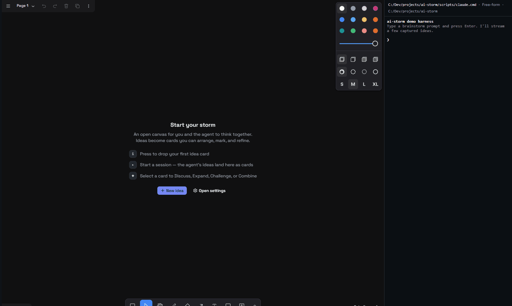
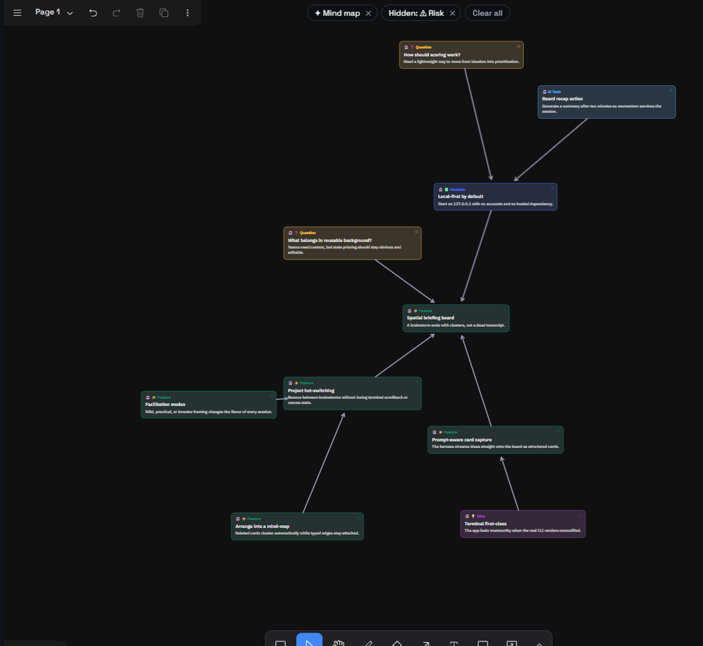
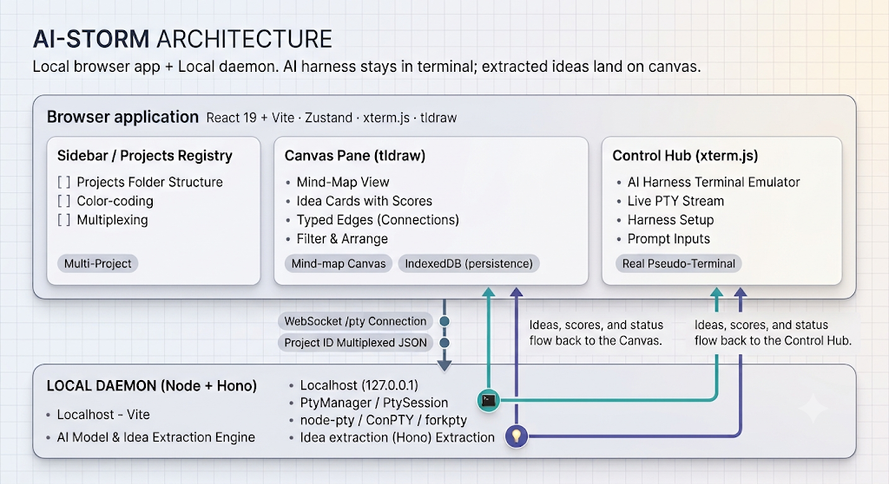

# ai-storm ⚡ brainstorm with your AI

**Turn your AI into a brainstorming partner on an infinite canvas.**

In a world where coding is commoditized, ideas become more scarce.
The goal is to have AI-driven brainstorming available on top of your existing tooling.

ai-storm uses the AI harness you already use; `claude`, `codex`, `pi`,
`opencode`, you name it, in a real terminal, and streams the conversation onto a
[tldraw](https://tldraw.dev) whiteboard. You chat on the right; ideas land as
cards on the canvas, ready to arrange, connect, score, and riff on.

And there is **no** lock in. You extract the ideas you want as markdown, JSON, GitHub issues, or whatever you let your AI do with them.



- **Local-first.** Everything runs on `127.0.0.1`. No cloud, no subscription. You bring it, you own it.
- **Bring your own harness.** It reuses the tools already on your machine,
  and the used CLI is configurable per project (even a plain shell works).
- **A real terminal, not a chat box.** Sessions run in a genuine
  pseudo-terminal (ConPTY / forkpty), so your CLI's full TUI renders and
  behaves exactly as it does in your normal terminal.

## Features

- **Idea types**: auto-generates feature, idea, risk, question, decision — cards carry a kind.
- **Your notes too**: Add your own ideas manually; edit any.
- **Card References**: Expand, Challenge, Find risks; send any card back for another round.
- **Facilitation modes**: Brainstorm in free-form, SCAMPER, Six Hats, Crazy-8s, Yes-and. Try a different technique to see what works best.
- **Smart arrangements**: priority grid, semantic mind map, with connectors between related ideas.
- **Filters & search**: board filters and idea search across all projects to keep it clean.
- **Mark & track**: Keep ideas for later (lightweight voting) and mark them done.
- **Board tools**: Command palette, statistics overview, and focus mode
  (`CTRL + SHIFT + F`) for more focus.
- **Hand-off formats**: Turn the board into a PRD, plan, task list, GitHub
  issues, plain markdown, or JSON.
- **Summarize & triage**: Let the AI synthesize the board or triage what's
  worth building and score them.
- **Issue linking**: Link idea cards to GitHub or Linear issues.
- **Projects & folders**: Isolated boards per project, organized into folders
  with per-project pages; export/import projects as a file.
- **Theming**: Dark/light/system plus palette, font, radius, density, and
  contrast knobs.



## Getting started

You need [Node.js](https://nodejs.org) ≥ 24, [git](https://git-scm.com), and
your AI CLI of choice.

**1. Install** — one line:

```sh
# Linux / macOS
curl -fsSL https://raw.githubusercontent.com/drdreo/ai-storm/main/scripts/install.sh | sh

# Windows (PowerShell)
irm https://raw.githubusercontent.com/drdreo/ai-storm/main/scripts/install.ps1 | iex
```

**2. Run:**

```sh
ai-storm
```

That's it. The app opens at `http://127.0.0.1:8787` and keeps running in the
background until you stop it.

| Command           | What it does                                    |
| ----------------- | ----------------------------------------------- |
| `ai-storm`        | Start the app and open it in your browser       |
| `ai-storm stop`   | Stop it (your brainstorm sessions survive)      |
| `ai-storm update` | Get the latest version                          |
| `ai-storm doctor` | Something not working? This says what's missing |
| `ai-storm status` | Is it running, and where                        |
| `ai-storm logs`   | Show the app's log (add `-f` to stream it)      |

Good to know: if port 8787 is busy, the launcher picks the next free one. Logs
live in `~/.local/state/ai-storm` (Linux), `~/Library/Application
Support/ai-storm` (macOS) or `%LOCALAPPDATA%\ai-storm` (Windows). Already have
a clone? `node packages/cli/bin/ai-storm.ts` runs the same launcher without
installing anything. Distribution rationale: PD-023.

## How it works



A local Node.js daemon owns the pseudo-terminals; the browser app is React 19
(Vite) with Zustand, shadcn/ui + Tailwind v4, an
[xterm.js](https://xtermjs.org) terminal fed the raw PTY stream, and a tldraw
canvas as the idea surface.

### The conversational session

A project session doesn't spawn a raw shell — it launches your configured AI
harness (default `claude`) inside a real pseudo-terminal via
[node-pty](https://github.com/microsoft/node-pty). Contract-aware harnesses
(`claude`, `pi`, `codex`, `opencode`) are primed at launch.
They will try to use the ai-storm MCP / tools / extension, otherwise fallback to a marker based contract via emitted `«IDEA»` / `«SCORE»`.

### Persistence

Each project's canvas is a tldraw store persisted to IndexedDB. The project
registry (titles, status, terminal config) is a Yjs CRDT document with its own
IndexedDB store via `y-indexeddb`. On boot the app rehydrates both and restores
the most recently active project.

## Development

For everyday use, prefer the launcher above. For development you want Vite's
HMR, so run two processes.

In root: `pnpm dev` (frontend + backend)

**Backend** (Node + Hono + node-pty):

```sh
cd backend
pnpm dev    # ws://127.0.0.1:8787/pty
```

**Frontend** (Vite dev server, proxies /pty → backend):

```sh
cd frontend
pnpm dev      # http://localhost:4200
```

For a single-process production deploy, build the client and let the backend
serve it:

```sh
cd frontend && pnpm build
cd ../backend && pnpm start -- --static ../frontend/dist
```

Requirements: **Node.js** ≥ 24.15 (backend uses native TS type-stripping),
**pnpm** via `corepack pnpm`, and a browser.

### Tests

```sh
# Unit — framework-agnostic core + Zustand stores (no browser needed)
cd frontend && pnpm test

# Integration — against a running backend (pnpm start first)
cd backend && node smoke_test.ts

# Browser E2E — Playwright runner
#   UI suite (backend-free)
cd frontend && pnpm e2e
cd frontend && pnpm e2e:ui            # headed/watch UI mode

#   Full suite incl. the ConPTY PTY round-trip
#   (needs the Node backend on :8787 — start `pnpm dev:backend` first)
cd frontend && pnpm e2e:all
```

### Logging & tracing

Frontend and backend emit structured flow logs and OpenTelemetry spans:

```sh
# Human-readable structured logs (level via AI_STORM_LOG=debug|info|warn|error)
cd backend && AI_STORM_LOG=debug pnpm start

# Export spans over OTLP (starts the OTel Node SDK via --import ./src/otel.ts)
cd backend && pnpm trace
#   point at a collector:
OTEL_EXPORTER_OTLP_ENDPOINT=http://localhost:4318 pnpm trace
```

The frontend mirrors the same shape (`frontend/src/lib/log.ts`), built on
[opentelemetry-browser](https://github.com/open-telemetry/opentelemetry-browser):
`ConsoleInstrumentation` and `ErrorsInstrumentation` are always registered, so
every `log.*`/`console.*` call and every uncaught error becomes an OTel log
record. Set `VITE_OTEL_EXPORTER_OTLP_ENDPOINT` (e.g. in a git-ignored
`frontend/.env.local`) and point both at the same collector to see a project
flow end-to-end. See
[`docs/design/observability.md`](docs/design/observability.md) (Jaeger
all-in-one is the current recommendation).
