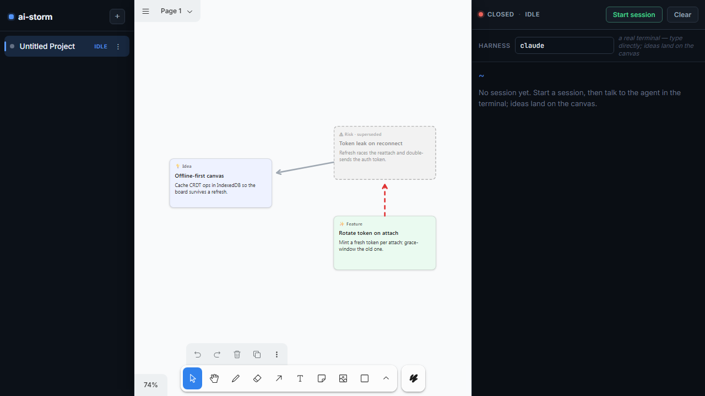

# Spike: tldraw vs. BlockSuite for the spatial idea canvas (#52)

**Status:** ✅ Complete — research/decision spike. Output is a recommendation + a
throwaway spike branch (`spike/tldraw-eval`), **not** a merge.
**Author:** ai-storm
**Recommendation:** **Revisit-later — do not replace now.** See §7 and **PD-013**.
**Related:** [`idea-graph.md`](./idea-graph.md) (#42 — the data model this aligns
with) · [`product-decisions.md`](../decisions/product-decisions.md) PD-004, PD-005,
PD-008, PD-010, PD-011, PD-012, PD-013 · issues #52, #40, #20, #22, #21, #16/#17

---

## 1. What was asked

Evaluate replacing the **BlockSuite** canvas (`AffineEditorContainer`,
`@blocksuite/* 0.19.5`) with **[tldraw](https://tldraw.dev)**, and find the
lowest-friction way to render a React canvas inside the Angular shell. The ticket
also flags that client-side IndexedDB *coupled to the canvas's own layers* may not
be the best persistence story, and muses about a backend store (SQLite) with a
simple exchange that re-renders a persisted data structure.

This is a **decision ticket**. It ends at a recommendation, not a replacement.

## 2. What was built (the spike)

A runnable spike on `spike/tldraw-eval` that proves the React→Angular path
**end-to-end inside the real shell** (not a sandbox):

- **The bridge** — `frontend/src/app/spike/tldraw-spike.component.ts` (67 lines):
  an Angular standalone component that mounts a React island with React 19's
  `createRoot` in `afterNextRender` and `unmount`s it in `ngOnDestroy`. No
  `@angular/elements`, no web-component wrapper, no Zone bridging (the app is
  zoneless). It is **lazy-loaded** behind `?spike=tldraw` via an `@defer` block, so
  React + tldraw land in their own esbuild chunk and stay out of the main bundle.
- **The React island** — `frontend/src/app/spike/tldraw-canvas.tsx` (262 lines):
  a `<Tldraw>` with
  - a **custom card shape** (`idea-card`) carrying the idea-graph node fields
    `{ kind, title, body, superseded }` — the tldraw analogue of an `affine:note`,
    with per-kind tints mirroring `KIND_REGISTRY` (idea-graph §3.2);
  - a **typed edge** — a native tldraw arrow *bound* to two cards (so it tracks
    them on move) whose `relation` (`about` | `supersedes`) lives in the arrow's
    `meta` and drives its styling (grey solid vs. red dashed);
  - **persistence** via `persistenceKey` → IndexedDB, transparent.
- **Seeded graph**: the canonical example from idea-graph §5.1 — an `idea`, a `risk`
  *about* it, and a `feature` that *supersedes* the risk (so the PD-012 ghost
  treatment and both relations are visible). Seeds only when the store is empty, so
  a reload restores rather than re-seeds.

### 2.1 Evidence

Built green (`pnpm build`) and driven headless with Playwright
(`frontend/spike-verify.mjs`):

```
1) first load  → cards: [Offline-first canvas, Token leak on reconnect, Rotate token on attach]; arrows: 2
2) reload      → cards: [Offline-first canvas, Token leak on reconnect, Rotate token on attach]; arrows: 2
RESULT:
  island mounted + custom cards rendered: PASS
  cards + edges survived reload:          PASS
```



The screenshot shows tldraw (with its own toolbar/zoom chrome) mounted in the
centre pane, the ai-storm sidebar and control hub unchanged around it, the three
kind-tinted cards, the grey `about` arrow (Risk→Idea), the red-dashed `supersedes`
arrow (Feature→Risk), and the **Risk card ghosted** (grey, dashed) as a supersede
target — the exact PD-012 lifecycle visual we ship today on BlockSuite.

## 3. The headline finding: the bridge is the easy part

The thing the ticket worried about — rendering React inside Angular — is **a
non-problem**. The whole bridge is ~70 lines and amounts to "give React a `<div>`
and tear it down on destroy." It composes cleanly with the existing architecture:
BlockSuite *already* lives behind a framework-agnostic boundary Angular never
reaches into (PD-004 §4.1), and a React island under an Angular host is the same
boundary with a different owner inside it. The zoneless app (PRD §5.1) means there
is no change-detection impedance to bridge.

Friction we *did* hit was all one-time tldraw-5 API/tooling calibration, not
architectural:

| Friction | Fix | One-time? |
| --- | --- | --- |
| JSX not configured | `jsx: react-jsx` + `jsxImportSource` in `tsconfig.json` (2 lines) | yes |
| Custom shape type rejected by `createShape`/`resizeBox` generics | augment `TLGlobalShapePropsMap` (tldraw 5's shape-registration hook) | yes, per shape |
| `BaseBoxShapeUtil` needs `getIndicatorPath`; `ShapeUtil` too | extend `ShapeUtil`, return a `Path2D` (was JSX `<rect>` in v3) | yes |
| Arrow `text` prop removed in v5 | label is rich-text now; relation carried in `meta` + styling | yes |
| `import 'tldraw/tldraw.css'` type error | ambient `declare module '*.css'` (`src/css.d.ts`) | yes |

**So the real cost of a replacement is not the bridge — it is rewriting
`canvas.service.ts` (941 lines) and the idea-graph that sits on it.** That is the
crux of the recommendation (§7).

## 4. Comparison

### 4.1 Data model — *advantage tldraw, for this product*

| | BlockSuite (today) | tldraw |
| --- | --- | --- |
| Native model | A **document tree** (`page → note → paragraph/list/code…`), with an edgeless **surface** holding notes + `affine:connector` elements | A flat **store of records**: `shapes` + first-class **`bindings`** (typed shape↔shape relationships) |
| Idea-graph node | `affine:note` (a rich-text sub-document) | a custom `idea-card` shape (typed props) |
| Idea-graph edge | `affine:connector` element **+** a side `ai-storm:edges` `Y.Map` to carry `relation` (the element has no relation field) | a binding — relation fits natively in shape/binding `meta`; or a bespoke `BindingUtil` |
| Identity / kind / provenance / lifecycle | **four** more namespaced side `Y.Map`s bolted on (`ai-storm:ref`, `:kind`, `:provenance`, `:lifecycle`) | shape `props` / `meta` carry these on the record itself |

The idea-graph (#42) is *natively a graph of nodes + typed edges* (idea-graph §2).
BlockSuite is a **document editor repurposed as a canvas**, so we expressed that
graph by bolting **five side `Y.Map`s + a connector + a lifecycle ghost** onto a
note tree (see `canvas.service.ts` §`applyIdeas`). tldraw's shapes-+-bindings model
*is* a node-+-typed-edge graph, so the same model maps on directly: the node fields
live on the shape, the relation lives on the binding/meta. Edges are first-class —
recall that BlockSuite's connector API was the one **unknown** the idea-graph plan
called out for a de-risking spike (idea-graph §7 Phase 0); in tldraw, bound
connectors are a built-in we used in three lines.

**Counter-point (BlockSuite's genuine edge):** a BlockSuite note is a *rich-text
sub-document* — card bodies get markdown, lists, code blocks, inline editing for
free, and `serializeToText` (PRD §3.2 context injection) walks that block tree. A
tldraw custom card holds **plain string props**; rich-text inside a shape means
adopting tldraw's text/rich-text machinery (more work). For a brainstorm card whose
body is a line or two this barely matters; if cards are meant to grow into rich
documents, BlockSuite is ahead.

### 4.2 Persistence — *a real trade-off, and the ticket's actual question*

- **BlockSuite (today):** Yjs **CRDT** → IndexedDB per subdoc (PD-005). Already
  wired, survives reload/crash, and — crucially — makes eventual multiplayer an
  *incremental* step rather than a rewrite (PD-001). The side-maps persist in the
  same subdoc.
- **tldraw:** `persistenceKey` → IndexedDB out of the box (**proven: survived
  reload**). But the tldraw store is **not a CRDT**; real-time multiplayer needs
  *tldraw sync* (their hosted/self-host service), a different model — Yjs's
  conflict-free merge is *not* free here.
- **On the ticket's SQLite musing:** this actually favours tldraw. A tldraw
  document is a plain, JSON-serializable **snapshot of records** (`getSnapshot` /
  `loadSnapshot`). Shipping that to a backend SQLite store and re-rendering it is
  markedly simpler than extracting/replaying a Yjs subdoc's binary updates. So *if*
  the goal is "backend store + simple exchange that re-renders a persisted data
  structure" (decouple storage from the canvas's own layers), tldraw's snapshot
  model is the easier substrate — **at the cost of** the local-first CRDT/offline-
  merge story PD-005 deliberately committed to. You can keep CRDT with a
  yjs↔tldraw store adapter, but that re-introduces the very coupling the ticket
  wanted to escape.

### 4.3 Feature parity & UX

- **Both:** infinite canvas, pan/zoom, selection, connectors/edges, custom shapes,
  IndexedDB persistence.
- **tldraw ahead:** purpose-built edgeless UX (smooth zoom/pan, snapping, selection
  handles, minimap, multi-shape ops), better perf at many shapes, a **clean,
  small, well-documented** shape/binding/tool API, a vibrant SDK. This is its whole
  job.
- **BlockSuite ahead:** the **page + edgeless dual view over one model** (PD-004),
  rich-text note bodies, and the `serializeToText` block-walk already feeding the
  AI loop. **However** — PD-011 already demoted the doc view to "a bonus with no
  bespoke UX," declaring the **edgeless surface the primary surface**. That removes
  most of BlockSuite's unique advantage *for this product*: we committed to the
  exact surface tldraw is purpose-built for, and we build no UX on the doc view that
  tldraw would have to replace.

### 4.4 Bundle size (measured, production build)

| Bundle | Raw | Transfer (est.) |
| --- | --- | --- |
| **Main** (Angular + BlockSuite + xterm + yjs) | 6.36 MB | 1.22 MB |
| **tldraw lazy chunk** (React + react-dom + tldraw) | 1.90 MB | 458 kB |
| Global styles (incl. `tldraw.css`) | 114.85 kB | 11.44 kB |

tldraw + React add a **1.90 MB / 458 kB** lazy chunk *on top of* BlockSuite in the
spike. But in a **replacement**, BlockSuite (the dominant share of that 6.36 MB
main — `@blocksuite/*` + Lit + Shiki syntax highlighting) would be **removed**.
Replacing therefore most likely **shrinks total bytes** (tldraw + React is lighter
than the full Affine editor stack), even after adding React's ~130 kB runtime. Not
precisely measured (would require actually removing BlockSuite), but directionally
clear: bundle size is **not** an argument *against* replacing.

### 4.5 Integration cost (the decisive axis)

- **React→Angular bridge:** ~70 lines, reusable, low-risk (§3). ✅
- **Framework-agnostic principle (PD-004 §4.1):** BlockSuite is consumed as a
  plain web component; tldraw is **React** — a hard framework dependency. This
  nicks a stated architectural principle, though the island keeps it contained.
- **The rewrite:** replacing means re-implementing, on tldraw, everything in
  `canvas.service.ts` (941 lines) + `idea-descriptors.ts` (148) + the element-
  toolbar verbs in `discuss-toolbar.ts` (92): the `applyIdeas` AI pipeline, short-
  ref identity, edges + connectors, kind registry + tint, provenance badge,
  lifecycle/supersede ghost, kind-visibility filtering (#21), the page/edgeless
  toggle, doc-title sync, sub-100ms hot-switch (PD-006), seeding/crash-recovery,
  and `serializeToText`. The card verbs (#13/#15) move from BlockSuite's edgeless
  element toolbar to tldraw UI overrides. **This is the bulk of the work, and it
  all currently works.**

## 5. Scorecard

| Axis | Winner | Margin |
| --- | --- | --- |
| Data-model fit for the idea-graph | **tldraw** | clear |
| Edges/connectors as a primitive | **tldraw** | clear |
| Canvas UX & perf | **tldraw** | clear |
| API clarity / docs / DX | **tldraw** | clear |
| Bundle size (post-replacement) | **tldraw** | mild |
| Rich-text card bodies | **BlockSuite** | clear |
| Local-first CRDT + free path to multiplayer | **BlockSuite** | clear |
| Page+edgeless dual view | **BlockSuite** | mild (PD-011 demoted it) |
| Framework-agnostic (PD-004) | **BlockSuite** | mild |
| **Cost to switch now** | **BlockSuite** (it's already built & shipped) | **decisive** |

tldraw is the better *foundation* on the merits. BlockSuite wins the only axis that
matters at this moment: **it already exists, works, and the idea-graph just shipped
on it** (PD-010/PD-012; the supersede mechanic merged in `b2bcd31`).

## 6. Risks of replacing now

1. **Large rewrite of a just-completed foundation.** #42 + the brainstorm-ux epic
   (#40/#19/#20/#22/#16) were designed and built on BlockSuite. Ripping it out to
   chase a cleaner model spends a big rewrite to fix problems we **don't yet have**.
2. **Lose the local-first CRDT story (PD-005) and the incremental path to
   multiplayer (PD-001)** unless we adopt tldraw sync or a yjs adapter.
3. **Lose rich-text note bodies** unless we invest in tldraw rich-text shapes.
4. **Trade the framework-agnostic principle (PD-004 §4.1)** for a React dependency.
5. **Opportunity cost:** that rewrite time competes with shipping #16/#17 (layout),
   #40 (per-kind shapes), and other user-facing brainstorm-ux value.

## 7. Recommendation — **revisit-later, with explicit triggers**

**Do not replace now.** Keep BlockSuite. The spike establishes the important fact:
**the React→Angular integration is cheap and de-risked**, so this decision can be
deferred without penalty — when a concrete need arises, the path is known and short.

tldraw is genuinely the better *spatial-canvas* foundation (model fit, edges, UX,
DX, likely smaller bundle), and PD-011's "edgeless is primary, doc view is a bonus"
stance erodes BlockSuite's main differentiator. But "better foundation" does not
justify rewriting a **working, freshly-shipped** graph layer pre-emptively, against
the local-first/CRDT and rich-text trade-offs above.

**Re-open this decision when a concrete BlockSuite limitation actually bites** —
most plausibly during:

- **#16/#17 (semantic layout / clustering):** if BlockSuite's connector/surface
  API proves fragile or fights us as the graph gets richer (it was already the one
  flagged unknown, idea-graph §7);
- **#40 (per-kind shapes):** if `affine:note` can't express the per-kind shapes we
  want and tldraw's custom shapes would;
- **canvas perf/UX** problems at scale that BlockSuite can't comfortably solve;
- a **persistence pivot** to a backend store (the ticket's SQLite idea), where
  tldraw's snapshot model is the easier substrate (§4.2).

### 7.1 If/when we do replace — sequencing against #42

The migration is **rendering + persistence only**; the *model* ports for free:

1. **Land #42 first / let it stabilize.** The shared `Idea`, `IdeaRelation`,
   `IdeaLink` types in `@ai-storm/shared` are **framework-neutral** and port
   verbatim — they are the contract, not a BlockSuite artifact. The extraction
   contract (`«IDEA…@ref!»`) and the AI `applyIdeas` *inputs* are unchanged.
2. **Port the kind registry** (idea-graph §3.2) to tldraw shape styling (the spike
   already shows the 1:1 mapping).
3. **Map nodes→shapes, edges→bindings.** `ai-storm:ref`/`:kind`/`:provenance`/
   `:lifecycle`/`:edges` collapse onto shape `props`/`meta` + bindings — fewer side
   structures than today.
4. **Reimplement `applyIdeas`** as `editor.createShapes(...)` + `createBinding(...)`
   (spike's `seedGraph`/`connect` are the skeleton), and `serializeToText` as a
   shape-store walk.
5. **Move the card verbs (#13/#15)** to tldraw UI overrides / context menu.
6. **Decide persistence deliberately:** tldraw `persistenceKey` (local-first, drop
   CRDT), or a yjs↔tldraw store adapter (keep CRDT), or backend SQLite snapshots
   (the ticket's goal — easiest on tldraw's record model).
7. Keep the React island bridge from this spike; delete the seed/demo code.

## 8. Out of scope (unchanged)

Actually shipping the replacement. This spike ends at the decision above (PD-013)
and the `spike/tldraw-eval` branch, which is **throwaway** — not for merge to main.
